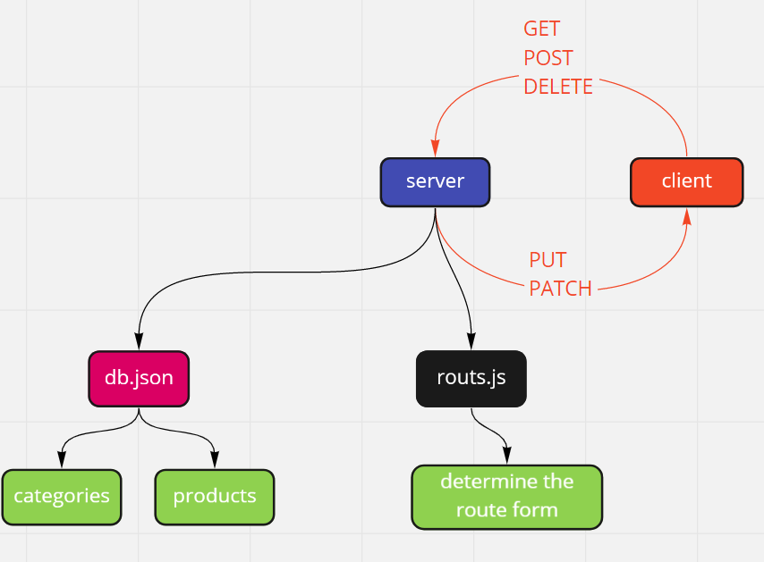
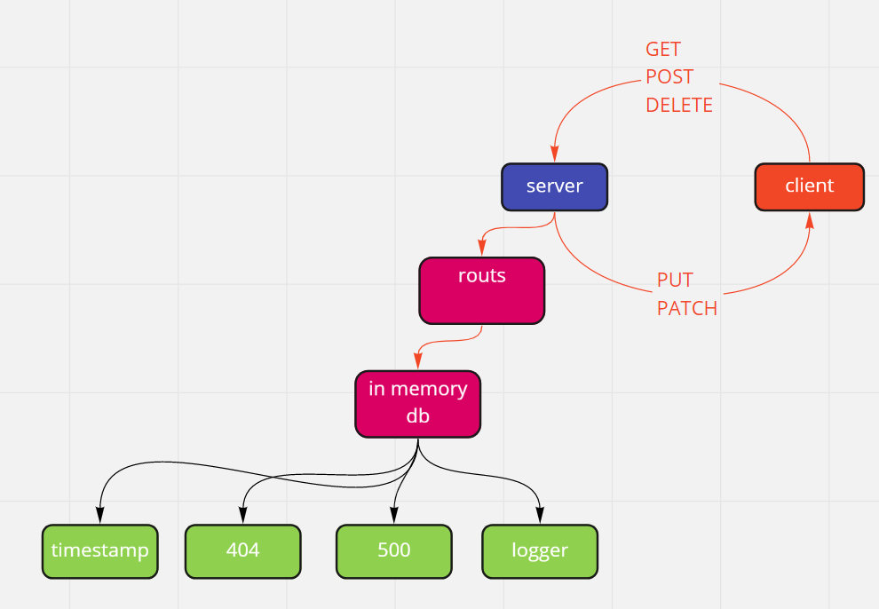
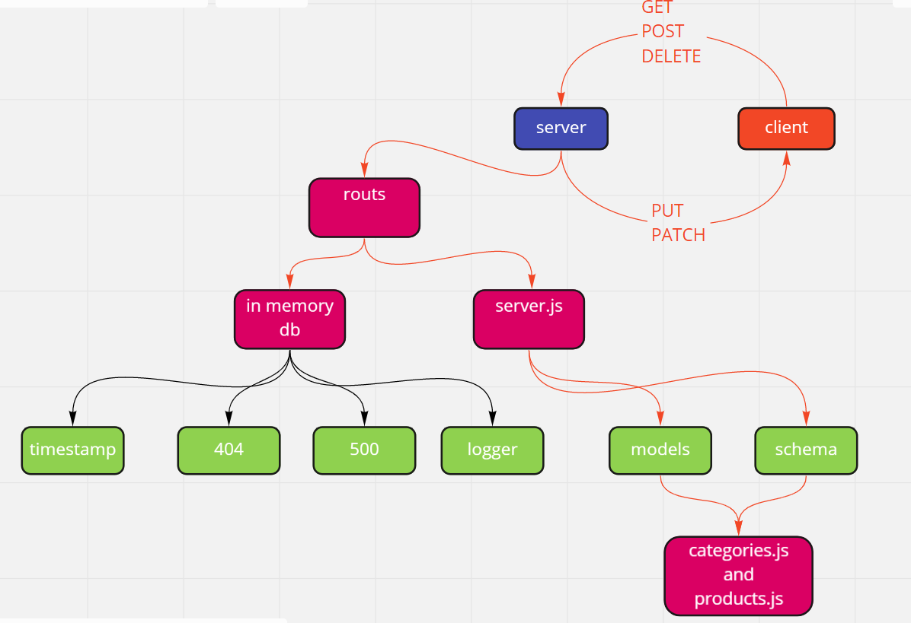

# api-server

_the aime of this app is to create a simple API-server_

### LINKS AND RESOURCES

[swaggerHub](https://app.swaggerhub.com/apis/Othabteh/API-server/0.1#/default/get_products)

### installation

- npm i -g json-server

### URL

- http://localhost:3000

### PORT

- 3000

### to run this app use this command

- json-server --id=\_id --port 3000 --watch ./data/db.json --routes ./data/routs.json

### UML

## lab-07

### installation

- npm i -g json-server
- npm init -y
- npm i express
- npm i -D supetest jest

### URL

- http://localhost:3030

### PORT

- 303030

### to run this app use this command

nodemon

### UML

## lab-08

### installation

- npm i -g json-server
- npm init -y
- npm i express
- npm i mongoose
- npm i morgan
- npm i cors
- npm i -D @code-fellows/supergoose
- npm i -D supetest jest

### URL

- http://localhost:3030/api/v1/categories
- http://localhost:3030/api/v2/products

### PORT

- 3030

### to run this app use this command

nodemon

### test

- testing all the routs and the server using supergoose

### UML

## lab-09

### installation

- npm i -g json-server
- npm init -y
- npm i express
- npm i mongoose
- npm i morgan
- npm i cors
- npm i -D @code-fellows/supergoose
- npm i -D supetest jest

### URL

- http://localhost:3030/api/v1/categories
- http://localhost:3030/api/v2/products

### PORT

- 3030

### to run this app use this command

nodemon

### test

- testing all the routs and the server using supergoose

### deployed site

[api-server](https://osama-api-sever.herokuapp.com)
**just add (api/v1/ctegories) after the .com**

### UML

